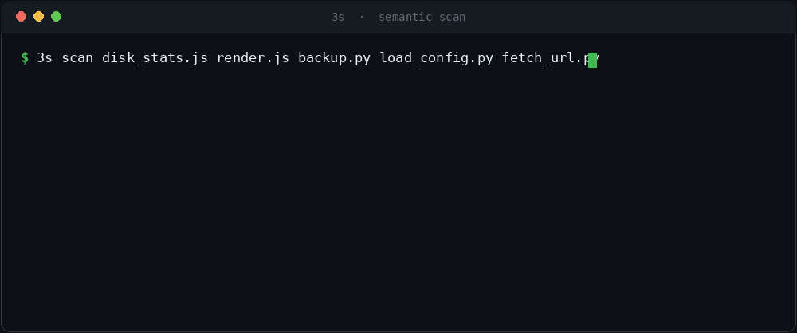
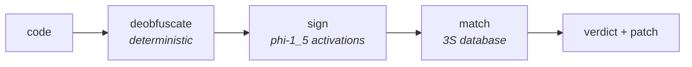
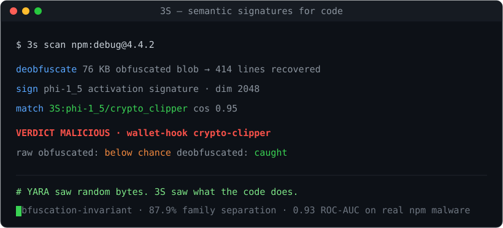

<h1 align="center">3S</h1>
<p align="center"><b>Semantic Signature Specification.</b> A portable, behavioral signature for what code does.</p>

<p align="center">
  
  
  
  
  
</p>

<p align="center"></p>

---

3S describes code by its **behavior**. A small model reads what a function *does* and reduces
it to a compact vector, a signature addressed as `3S:<model>/<family>`. Rename the variables,
refactor the control flow, and (once any packing is deterministically resolved) obfuscate it.
The signature keeps matching, because it was never keyed on the surface text.

This is a **complement** to the tools you already run. Byte and string rules, ASTs, taint
analysis, and reputation feeds each read a real signal. 3S adds a different one, a behavioral
layer, and it is most useful exactly where surface signals go quiet: minified bundles,
machine-rewritten payloads, and code that has been reshaped specifically to look benign.

## Why behavior

The 2025 and 2026 npm supply-chain attacks were built to slip past text matching. The
`chalk`/`debug` compromise shipped a crypto-clipper as a 76 KB obfuscated blob; the
Shai-Hulud and keyv worms hid credential stealers behind packing and inside files scanners
do not read. What stayed constant through every rewrite was the behavior: read the wallet
address, swap it, exfiltrate the token. A signature keyed on behavior has something to hold.

## What 3S contributes

- A **spec** for the signature: how a signature is computed, recorded, and matched, so an
  implementation is reproducible rather than a black box ([`SPECIFICATION.md`](SPECIFICATION.md)).
- A **behavioral family taxonomy** that names what code does (`crypto_clipper`,
  `command_injection`, `data_exfiltration`), organized by measurement rather than assertion.
- A **reference database** and scanner you can run, plus the corpora it was built from.

## Results

- **91.0%** leave-one-out separation across **13 behavioral families**, eight of them
  perfect, under a 1.3B model reading only behavior.
- **Cross-language**: the same 13 behaviors in Python separate at **88.9%**; 3S carries a
  signature database per language (npm and PyPI), since a behavior reads differently across
  ecosystems.
- **0.93 ROC-AUC** distinguishing real npm malware from real benign packages, held out, and
  it holds against obscure packages smaller than the malware.
- **Caught the real `chalk`/`debug` crypto-clipper** through its obfuscation: raw signs
  below chance, deobfuscated lands on `crypto_clipper`.
- **12/12** signature-selected patches confirmed by an AddressSanitizer oracle on C
  vulnerabilities, renamed and refactored clones included.

## Quick start

```bash
git clone https://github.com/calysteon/pre-collapse
cd pre-collapse/engine
pip install -r requirements.txt          # numpy, pytest, plus gcc for the oracle
python scripts/demo.py                    # offline: signatures + database + real ASan runs
```

Browse the reference signature database in [`3s/database.json`](3s/database.json), or
rebuild it from source with `python 3s/build_families.py`.

## How it works



<p align="center"></p>

Deobfuscation is deterministic on purpose: the model is unreliable at the arithmetic a
packer's decoder needs, so a static tool resolves it, and the model does the semantic
reading it is good at. The match is one lookup that returns both the behavior and the
response, which is the `(signature, patch)` unit the [white paper](WHITEPAPER.md) argues for.

## What is here

| | |
|---|---|
| [`SPECIFICATION.md`](SPECIFICATION.md) | the 3S standard: format, matching, family taxonomy, conformance |
| [`WHITEPAPER.md`](WHITEPAPER.md) | the argument: why a behavioral signature is worth defining |
| [`3s/`](3s/) | the reference signature database: 13 families, 91.0% separation |
| [`engine/`](engine/) | the `(signature → patch)` loop on C vulnerabilities, ASan-verified |
| [`supply-chain/`](supply-chain/) | 3S applied to real npm malware, deobfuscate → sign → detect |
| [`ANNOUNCEMENT.md`](ANNOUNCEMENT.md) | the short version |

## Contributing

The taxonomy is meant to grow. Add a signature for a family that is defined but not yet
populated, or propose a new behavior with the corpus that grounds it. See
[`SPECIFICATION.md`](SPECIFICATION.md) section 10 and [`3s/README.md`](3s/README.md).
