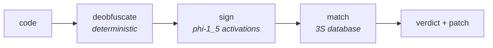

<h1 align="center">3S</h1>
<p align="center"><b>Semantic signatures for code.</b> The obfuscation-proof successor to YARA.</p>

<p align="center">
  
  
  
  
</p>

<p align="center"></p>

---

A **YARA** rule lists bytes and strings. It shatters the moment an attacker renames a
variable, minifies, or packs the payload. **3S** keys on behavior instead: a small model
reads what code *does* and reduces it to a portable signature. Rename it, refactor it, and
(once the packing is deterministically resolved) obfuscate it. The signature keeps matching.

Where a YARA rule says *these bytes appear*, a 3S signature says *this code behaves like
this*, addressed as `3S:<model>/<family>`.

## Why now

The 2025 and 2026 npm supply-chain attacks were built to defeat syntactic detection. The
`chalk`/`debug` compromise shipped a crypto-clipper as a 76 KB obfuscated blob; the
Shai-Hulud and keyv worms hid credential stealers behind packing and inside files scanners
do not read. Each evaded byte and string rules by construction, because those rules were
never looking at what the code does.

## Results

- **87.9%** leave-one-out separation across **13 behavioral families**, seven of them
  perfect, under a 1.3B model reading only behavior.
- **0.93 ROC-AUC** detecting real npm malware versus real benign packages, held out, and it
  holds against obscure packages smaller than the malware.
- **Caught the real `chalk`/`debug` crypto-clipper** through its obfuscation: raw signs
  below chance, deobfuscated lands on `crypto_clipper`.
- **12/12** signature-selected patches confirmed by an AddressSanitizer oracle on C
  vulnerabilities, renamed and refactored clones included.

## Quick start

```bash
git clone https://github.com/calysteon/pre-collapse
cd pre-collapse/engine
pip install -r requirements.txt          # numpy, pytest, plus gcc for the oracle
python scripts/demo.py                    # offline: signatures + database + real ASan runs
```

Browse the reference signature database in [`3s/database.json`](3s/database.json), or
rebuild it from source with `python 3s/build_families.py`.

## How it works



Deobfuscation is deterministic on purpose: the model is unreliable at the arithmetic a
packer's decoder needs, so a static tool resolves it, and the model does the semantic
reading it is good at. The match is one lookup that returns both the behavior and the
response, which is the `(signature, patch)` unit the [white paper](WHITEPAPER.md) argues for.

## What is here

| | |
|---|---|
| [`SPECIFICATION.md`](SPECIFICATION.md) | the 3S standard: format, matching, family taxonomy, conformance |
| [`WHITEPAPER.md`](WHITEPAPER.md) | the argument: why security knowledge should be semantic |
| [`3s/`](3s/) | the reference signature database: 13 families, 87.9% separation |
| [`engine/`](engine/) | the `(signature → patch)` loop on C vulnerabilities, ASan-verified |
| [`supply-chain/`](supply-chain/) | 3S applied to real npm malware, deobfuscate → sign → detect |
| [`ANNOUNCEMENT.md`](ANNOUNCEMENT.md) | the short version |

## Contributing

The taxonomy is meant to grow the way YARA rulesets and the CWE list grew. Add a signature
for a family that is defined but not yet populated, or propose a new behavior. See
[`SPECIFICATION.md`](SPECIFICATION.md) section 10 and [`3s/README.md`](3s/README.md).
